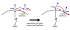
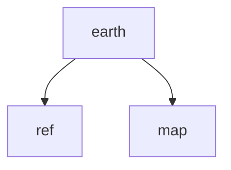

# flat_earth
[EarthTfPublisher](#EarthTfPublisher) publishes a TrasnformStamped between `/earth` frame and `/map` frame.  
The reference point is specified by a GeoPointStamped message.  
The transform between `/earth` and `/map` changes continuously as the contact point changes.

# EarthTfPublisher

## Subscribing Topics
- `ref` ([geographic_msgs/GeoPointStamped](https://docs.ros.org/en/noetic/api/geographic_msgs/html/msg/GeoPointStamped.html))  
  The contact point of `/map` frame and the earth ellipsoid.  
  The first `ref` topic will be used as origin of `/map` frame.  
  The transform from the specified frame_id to `/map` frame must be available.  
  Zeroing out the altitude field of the GeoPointStamped is recommended.
- `request` (std_msgs/Time)  
  Requesting broadcasting current TF with specified timestamp.

## Publishing Topics
- `/tf` ([tf2_msgs/TFMessage](https://docs.ros.org/en/noetic/api/tf2_msgs/html/msg/TFMessage.html))  
  Two transform will be published.

## Parameters
| Name | Type | Default | Description |
| --- | :-: | :-: | --- |
| `~earth_frame_id` | str | `"earth"` | The name of `/earth` frame. |
| `~map_frame_id` | str | `"map"` | The name of `/map` frame. |
| `~ref_frame_id` | str | `"ref"` | The name of `/ref` frame. Specifying empty string disables publishing `ref` frame. |
| `~allow_time_reversal` | bool | false | If true, this node suppresses publishing of TF frame with a timestamp earlier than previously published TF frame. |
| `~tf_timeout` | double | 1.0 [s] | Timeout of internal TF looking up. |
| `~publish_period` | double | 0.0 [s] | Publishing period of `/tf` topic. Specifying 0 disables periodic publishment. |
